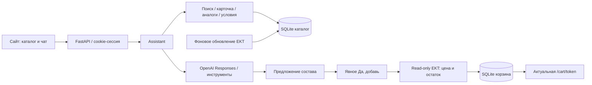

# Memory Munchers — EKT Assistant

Альтернативная Python-версия для **HACKALEM AI**, кейс ТОО «Электрокомплект»: сайт с чатом, характеристики и сертификаты, объяснимые аналоги и корзина после явного подтверждения. Покупатель получает консультацию в одном окне; менеджеру остаются сложные вопросы.

В комплекте **15 035 реальных карточек EKT**. Сохранённые цена и остаток обозначаются как снимок; перед добавлением сервер перепроверяет их через API партнёра.

**Граница прототипа:** ссылка открывает актуальную локальную корзину. Производственный checkout ekt.kz не подключён. Полное соответствие ограничениям кейса пока не достигнуто: [подробный аудит](docs/HACKALEM_COMPLIANCE.md).

## Docker: запуск за пять команд

Нужен работающий Docker Engine с Compose; на Windows — Docker Desktop в режиме Linux containers. Python, Node.js и PostgreSQL на компьютере для этого запуска не нужны.

```powershell
git clone --branch alternative_version --single-branch https://github.com/BAITC-Hacks/hack-b6e61115-memory-munchers.git ekt-assistant
Set-Location ekt-assistant
Copy-Item .env.example .env
docker compose up --build -d --wait --wait-timeout 180
Invoke-RestMethod http://127.0.0.1:8001/health
```

Открыть **[магазин и чат](http://127.0.0.1:8001/)**. Полная инструкция Windows/Linux/macOS, переменные, volume, остановка и диагностика — **[docs/DOCKER.md](docs/DOCKER.md)**.

Без ключей работают каталог, локальный поиск, условия, аналоги, история и подготовка состава. Сложный диалог и фото требуют `OPENAI_API_KEY`. Завершение добавления требует рабочего `EKT_API_USER` / `EKT_API_PASSWORD`: без подтверждённого остатка сервер отказывает и не меняет корзину. Для полного сценария заполни `.env` до команды запуска; файл в Git и образ не попадает.

CMS: [/admin](http://127.0.0.1:8001/admin), для Docker задай `CMS_ADMIN_TOKEN` и введи его в форме. SQLite сохраняется в volume `ekt-assistant_data`. `docker compose down` сохраняет данные. Telegram в Compose отключён.

## Состав ветки

Корневые `app/`, `scripts/`, `tests/`, `Dockerfile`, `compose.yaml` — Python-версия. Существующие `MemoryMunchers/` и `frontend/` сохраняют прежнюю .NET-версию команды; этот Docker их не запускает. Исходная инструкция сохранена в [docs/LEGACY_DOTNET.md](docs/LEGACY_DOTNET.md) в checkout ветки. История `alternative_version` сохраняется.

## Архитектура и агентность



Модель выбирает `search_catalog`, `product_details`, `find_alternatives`, `purchase_terms`, `previous_requests`, `propose_cart` и технический поиск. Шаги видны в чате. Сервер формирует карточки из каталога и контролирует согласие: инструмента подтверждения у модели нет. Предложение не меняет корзину. Повтор не удваивает количество; чужое предложение, недостаточный остаток и изменившаяся цена отклоняются. Очистка тоже требует явного согласия.

Точные артикулы, условия и простые сценарии работают локально. Сложные запросы используют OpenAI Responses; текущая конфигурация приложения — `gpt-5.4-mini`. Бюджет ядра 7,2 секунды, веб-обработчика около 7,6 секунды. При сбое возвращается понятный отказ/уточнение; это предел ожидания, а не гарантия полного ответа любой сложности.

## Данные и вложения

- `data/raw_details.jsonl`: 15 035 карточек партнёра, примерно 48,7 МБ; Git LFS не нужен. Артикулы, категории, характеристики, документы, цены и склады.
- `/app/data/catalog.sqlite`: локальный каталог; `assistant.sqlite`: диалоги, предложения, корзины и подборы; `cms.sqlite`: CMS. Создаются при запуске, не коммитятся.
- Сертификаты берутся из выгрузки/страницы EKT; внутренний ID файла не выдаётся за URL. Условия в `app/terms.py` содержат источник; неизвестная минимальная партия не придумывается.
- Поддержаны XLSX, DOCX, текстовый PDF, JPEG/PNG. XLS/DOC нужно пересохранить, PDF-скан требует фото страницы. Excel ограничен 100 строками, 4 листами, 20 000 символами и 8 МиБ XML; частичный результат помечается. Максимальное вложение — 15 МиБ.

Синхронизация отключена по умолчанию в Compose. `CATALOG_SYNC_ENABLED=1` включает обновление перечня и партий карточек каждые 300 секунд; это не обещание обновления всех остатков за пять минут.

## Проверка и сценарий жюри

1. `010500006_`: характеристики, склады и сертификаты.
2. `310100024_`: отсутствующая позиция и объяснимые аналоги.
3. `Какие оплата, доставка и минимальная партия?`.
4. Подготовить две единицы товара: корзина пуста до отдельного `Да, добавь`.
5. Подтвердить при рабочем EKT API, открыть ссылку; повторить подтверждение — дублей нет.

Локальная проверка после `setup.bat`:

```powershell
.venv\Scripts\python.exe -m pytest tests -q
```

Без Docker: `setup.bat`, заполнить `.env`, `start-site.bat`. Для уже запущенного тестового сайта с рабочим EKT API: `.venv\Scripts\python.exe scripts\smoke_integration.py --base http://127.0.0.1:8001`. Скрипт создаёт локальные корзины/подборы; production checkout не вызывает. CMS-токен передаётся через окружение. Не запускай изменяющий данные smoke на проде без отдельного разрешения.

Фактические результаты подготовки — [HACKALEM_COMPLIANCE](docs/HACKALEM_COMPLIANCE.md), [PROGRESS](PROGRESS.md). Старые замеры в [PERFORMANCE_CORE](docs/PERFORMANCE_CORE.md) относятся к предыдущей сборке.

## Незакрытые ограничения

Нужен официальный cart/session API для checkout EKT. Оплаченные заказы магазина не импортируются; сохранённые подборы не называются заказами. Казахский и передача реальному менеджеру не реализованы как законченные сценарии. Совместимость с production-платформой требует проверки партнёра.

Формы оплаты нет, ассистенту запрещено просить реквизиты. Но произвольно присланный текст сохраняется: автоматического обнаружения/удаления платёжных данных нет. Поэтому ограничение кейса «не хранить платёжные данные» закрыто не полностью.

Разработано с **Codex**. Команда репозитория: **Memory Munchers**. Подготовка Python-версии: Адиль / QazSight.

Предыдущая документация интеграции и исторические замеры: [INTEGRATION_HISTORY](docs/INTEGRATION_HISTORY.md).
