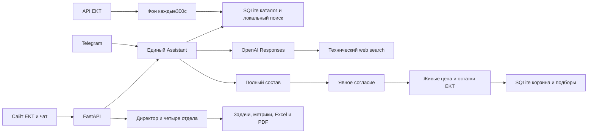

# EKT — магазин с ИИ-ассистентом и CMS

Помогает покупателю электротехники найти товар среди **15 035 реальных карточек EKT**, проверить характеристики, подобрать аналог и собрать корзину только после явного согласия.

## Проблема и решение

Покупателю нужны точные артикулы, наличие и документы, а при отсутствии позиции — обоснованная замена. Ассистент принимает свободный запрос или Excel/Word/PDF/фото, ищет по каталогу, уточняет задачу и показывает полный состав. Только отдельное «Да, добавь» запускает живую проверку цены/остатков и меняет корзину. Повтор подтверждения не дублирует товары.

Магазин использует визуальную основу предоставленного `ekt-astana.html`: шапку, навигацию, каталог и оформление EKT. Отдельный интерфейс ассистента выполнен в стиле Codex. Карточки и ответы работают через backend; демонстрационный движок исходного макета не используется.

## Демо и запуск

Локально: [магазин](http://127.0.0.1:8001/), [CMS](http://127.0.0.1:8001/admin).

Публичный магазин: **[ekt-web-production.up.railway.app](https://ekt-web-production.up.railway.app/)**; [CMS](https://ekt-web-production.up.railway.app/admin). Railway deployment SUCCESS, `/health`200,15 035 товаров, gpt-5.4-mini; два публичных сквозных прогона PASS, максимум действия1,202с. Новый проект: `4b7ffa4a-f7e0-470e-a43e-1b63029ab6e0`, сервис `ekt-web`, volume `/app/data`.

На Windows достаточно двух команд:

```powershell
.\setup.bat
.\start-site.bat
```

Между ними заполнить `.env` по `.env.example`: доступ OpenAI/EKT; для удалённой CMS — `CMS_ADMIN_TOKEN`. `start-site.bat` запускает только сайт. Отдельный `start.bat` запускает приложение на8000 с Telegram, если токен настроен. Один Telegram-токен обслуживает только один polling-процесс.

## Архитектура



`data/catalog.sqlite` — каталог; `assistant.sqlite` — диалоги, корзины, сохранённые подборы; `cms.sqlite` — задачи и контент. `raw_details.jsonl` используется как одноразовый seed. Обычные ответы работают локально, не ждут удалённый каталог.

Фон каждые300с обновляет перечень и очередь новых/изменённых карточек. Детали и остатки обновляются партиями до200 товаров за проход, с приоритетом просмотров и rolling cursor. **Все15 035 остатков каждые5мин не обещаются.** Дата списка, очередь и покрытие свежими остатками видны в CMS. Ошибка/неполная загрузка EKT не удаляет локальные товары; SQLite lease исключает дублирующие обходы.

Реальный локальный проход завершён успешно23.09.2026 в17:37:58 UTC+5: получен полный перечень **15 037 товаров**, две новые карточки добавлены в SQLite, обновлены200деталей, ошибок и ожидающих новых/изменённых карточек0. Это подтверждает синхронизацию списка и партии, а не свежесть всех остатков одновременно.

При «товар точно есть на сайте» выполняется проверка EKT, найденная полная карточка импортируется в SQLite и запускается дополнительный цикл. Ожидание ограничено1,9с; незавершённая проверка честно продолжается в фоне. Подтверждение корзины отдельно проверяет актуальный остаток.

## Где агентность, скорость и качество

Модель выбирает поиск/уточнения, разбирает задачу и вложения, подключает протокол менеджера после повторного затруднения и использует интернет для технического контекста. Затем возвращается к ассортименту EKT. Сервер формирует карточки из БД и контролирует товары, согласие и остаток. Модель не может сама подтвердить корзину; действия инструментов видны в чате.

- Онлайн: **gpt-5.4-mini**, один проход Responses, короткий контекст, до650 выходных токенов. Артикулы, условия, состав и подтверждение идут без LLM.
- Исходный эталон качества: **o1-pro**, прямые ответы36,392/46,961с. Сохранён для сравнения; в онлайн-пути больше не используется, автоматического перехода на него нет.
- Цель2с; бюджет ядра7,2с, веб-обёртки7,6с. При задержке — достоверный локальный результат или уточнение. Незавершённый подбор не объявляется успешным; загрузка файла клиентом и доставка Telegram учитываются отдельно.
- Финальный замер ядра на версии `43ee1f5`:14 завершённых сценариев и1 явно частичный Excel, максимум6,6045с. Для15 сценариев оценка API **$0.026134**,7 сценариев без LLM. Это оценка конкретного прогона, не счёт провайдера и не статистическая гарантия p95.

Подробности и источники измерений: [PERFORMANCE_CORE](docs/PERFORMANCE_CORE.md), [передача ядра](docs/ASSISTANT_HANDOFF.md), `data/fast_flow_results.json`.

## CMS и маршруты

`/admin`: директор → маркетинг, продажи, разработка, поддержка; CRUD задач с ответственным/сроком/статусом; фильтры отдела/дат; приветствие и заметка о доставке; состояние синхронизации; XLSX/PDF. Метрики — реальные агрегаты SQLite и `metrics.jsonl`, без текстов диалогов и идентификаторов покупателей. Нет источника — «Нет данных».

- Магазин: `/api/catalog`, `/api/catalog/{id}`, `/api/session`, `/api/chat`, `/api/attachment`.
- Корзина: `/api/proposal`, `/api/confirm`, `/api/cart`, `/cart/{token}`, `/api/orders/save`, повтор сохранённого подбора.
- CMS: `/api/admin/summary`, `/api/admin/departments`, `/api/admin/tasks`, `/api/admin/content`.
- Экспорт: `/api/admin/exports/xlsx`, `/api/admin/exports/pdf`.
- Синхронизация: `/api/admin/catalog-sync`, POST `/api/admin/catalog-sync/trigger`.
- Готовность: `/health`.

Без `CMS_ADMIN_TOKEN` административный API доступен только с loopback. При настроенном токене он требуется и локально: `X-Admin-Token` или Bearer. Иерархия отделов — организационная структура/фильтр; персональные аккаунты и RBAC не реализованы.

## Что сделано и проверено

Объединены существующее ядро и исходный магазин; добавлены веб-сессии, подтверждение и повтор подбора, CMS, экспорт, SQLite-каталог, фон, проверки и комплект Railway.

- Общий финальный прогон: **164 passed +66 subtests,63,70с**.
- Два реальных локальных HTTP-сценария сайта: оба PASS, все запросы200, максимум одного действия **0,478с**. Проверены артикул, аналог, условия, пустая корзина до согласия, живое подтверждение, ссылка, отсутствие дублей, сохранение/повтор, CMS и экспорты. Источник: `data/integration-smoke.json`. Это быстрые серверные маршруты, не замер генерации LLM.
- Два публичных сценария Railway: оба PASS, максимум **1,202с**. Источник: `data/integration-smoke-railway.json`. `/health` вернул200; Linux image построен и запущен Railway.
- До кода: GET карточки EKT200×3,0,175–0,207с (`data/baseline_http.json`); дорогая модель проверена отдельно (`data/benchmark_direct_model_baseline.json`).
- PDF проверен через pypdf и визуально после Poppler. XLSX — openpyxl, фильтры/типы/форматы и рендер. CMS+sync отдельно40 тестов PASS; после изменения фонового таймаута17 sync tests PASS.
- Страница списка1000 товаров EKT: HTTP200 за11,964с. Начальный фон с5с исправлен:20с на список,5с на детали,240с на проход; чат этого не ждёт.

Проверка изменений: `.venv\Scripts\python.exe -m pytest tests -q`. Два сценария запущенного сайта: `.venv\Scripts\python.exe scripts\smoke_integration.py`. Публичный результат выпуска фиксируется отдельно в [PROGRESS](PROGRESS.md).

## Ограничения

**Корзина ассистента сохраняется в SQLite, но не является checkout ekt.kz.** API переноса browser session/cart-token партнёр не предоставил. Ссылка открывает актуальную нашу корзину; резервирование, оплата и заказ EKT не выполняются. Сайт EKT и его корзины не изменялись.

История — диалог и сохранённые здесь подборы, не прошлые оплаченные заказы EKT; для них нужен history API. Веб и Telegram автоматически не объединяют корзины разных клиентских идентификаторов.

Excel читается фрагментом: первые100строк,4листа, до20 000символов и8MiB XML, с предупреждением. Полная большая спецификация за8с не обещается. Старые XLS/DOC нужно пересохранить; PDF-сканы требуют изображений страниц. Фото даёт кандидатов по маркировке, не гарантию точной модели. Неизвестная кратность или электрическая совместимость не выдумываются.

## Размещение и передача

Docker: Python3.13, DejaVu для русского PDF, volume `/app/data`, seed отдельно вне volume. Комплект `deploy/railway` исключает `.env`, SQLite, историю и логи. [DEPLOYMENT](docs/DEPLOYMENT.md) описывает сборку и проверки. Локальный Docker Engine недоступен; Linux build и запуск подтверждены успешным Railway deployment.

Все требования с приёмкой и готовыми промптами — [TODO](TODO.md). Журнал и остаток работы — [PROGRESS](PROGRESS.md); контракт объединения — [INTEGRATION](docs/INTEGRATION.md).

Стек: FastAPI, Python, SQLite, OpenAI Responses, HTML/CSS/JS, python-telegram-bot, openpyxl, reportlab. **Разработано с Codex.** Команда: Адиль / QazSight.
